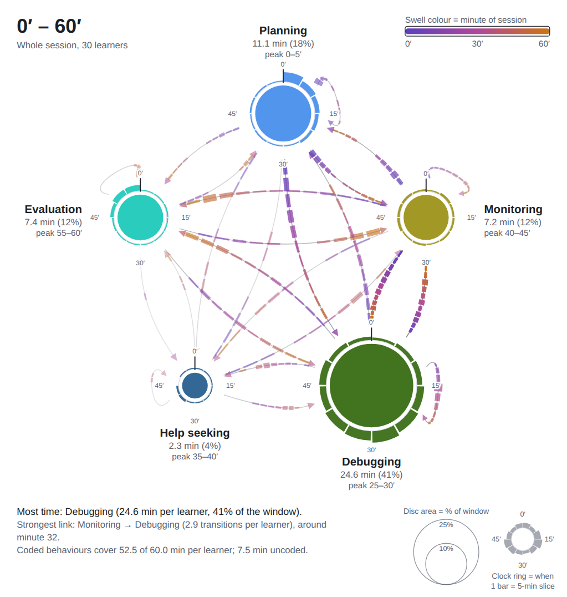

# Temporal ONA builder

A browser tool that turns a coded self-regulated learning (SRL) log into an ordered network showing, in one figure:

- **how long** learners spent in each behaviour (disc area = share of the time window),
- **when** each behaviour happened (a clock ring of bars around each disc: 0′ at the top, clockwise, with minute numbers at the quarter points and the peak slice written under each label),
- **what followed what** (directed arrows, ONA-style moving window),
- **when each link happened** (timeline arrows that swell in the minutes the link occurred, coloured early to late).

Everything runs in the browser. No data is uploaded.



## Use it

Open the site: **https://kcodweb.github.io/Temporal-ONA-builder/**

1. **Upload.** Drop a CSV, TSV or semicolon-separated file onto the page, choose it with **Choose file**, or paste rows. No data yet? Try the built-in sample of 30 synthetic learners, or download the template.
2. **Check.** See how each column was read, change the column choices if needed, and look over the first rows, the behaviours found and any warnings (unreadable rows, `09:12`-style times, a missing end column).
3. **Explore.** Build the network, step through time frames or drag the window, click a disc to highlight only its links and see its details, and save the figure as PNG or SVG.

The page remembers your last log on this device, so next time it opens straight on your figure. **Clear saved data** removes it.

Times can be minutes (`12.5`), `mm:ss` (`12:30`) or clock time (`09:12:30`). Without an `end` column, each episode lasts until that learner's next episode starts.

```csv
learner,behaviour,start,end
S01,Planning,09:00:00,09:02:40
S01,Monitoring,09:02:40,09:03:30
S01,Debugging,09:03:45,09:07:10
```

## Put it online

The whole tool is one file, `index.html`, with no build step and no server code.

**GitHub Pages**
1. Create a public repository and upload `index.html`, `README.md` and `preview.png`.
2. Go to **Settings → Pages**, set **Source** to *Deploy from a branch*, choose `main` and `/ (root)`, and save.
3. The site appears at `https://<your-username>.github.io/<repository-name>/` within a minute or two.

**Netlify Drop**
Drag this folder onto https://app.netlify.com/drop to get a public link without an account setup step.

Any static host (Vercel, Cloudflare Pages, a university web space) works the same way: serve `index.html`.

## Develop

```
npm install
npm test          # smoke tests against the real page
npm run figures   # export figure SVGs to figures/
```

See `CLAUDE.md` for the code map, formulas, design rules and roadmap.

## Scope

The link logic is adapted from ordered network analysis (ONA): each episode is linked from the previous *w* − 1 episodes. This is a descriptive visualisation, not a full ONA. It does not normalise connection vectors, reduce dimensions or test differences between groups. Use ONA for statistical comparisons.

## Privacy

The page makes no network requests except to load Google Fonts. The last pasted log and settings are kept in the browser's local storage for convenience; **Clear saved data** removes them. Use pseudonymous learner IDs with real student data.

## Cite

Bansal, K. (2026). *Temporal ONA builder* [Web tool].

## Licence

The code is released under the [MIT licence](LICENSE). The white paper and other documents in `docs/` are released under [CC BY 4.0](docs/LICENSE.md).
